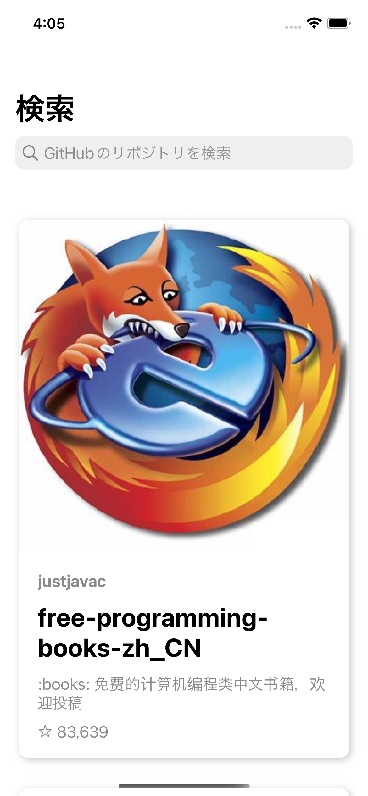
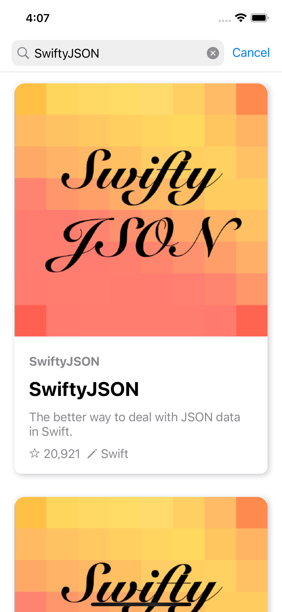
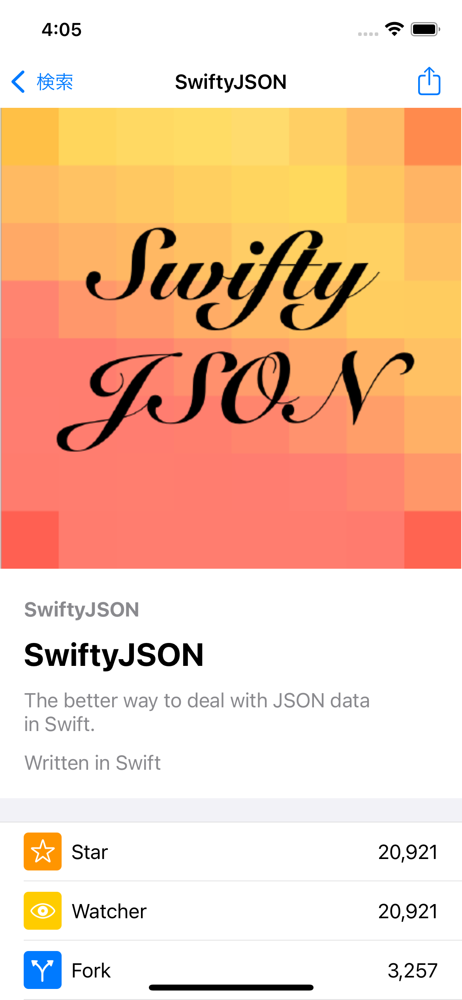
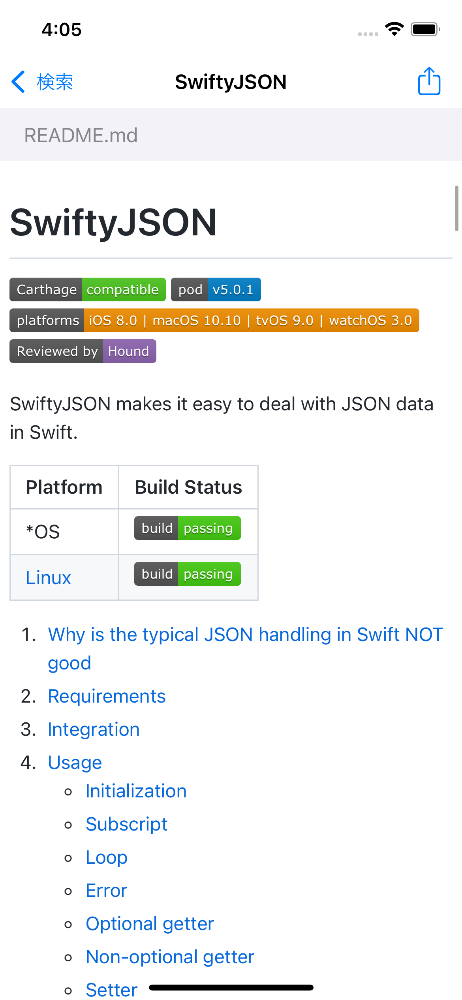
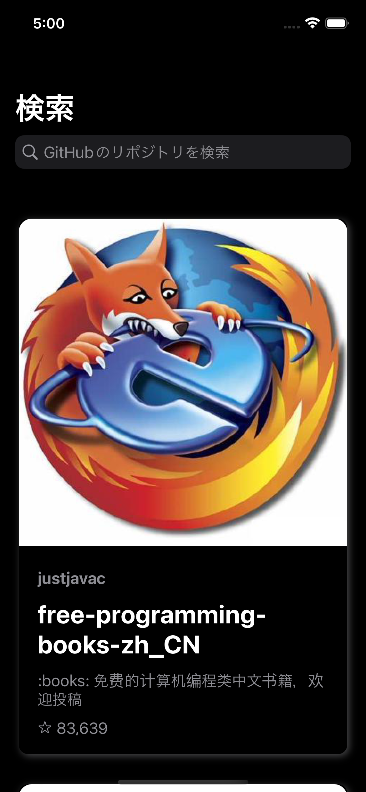
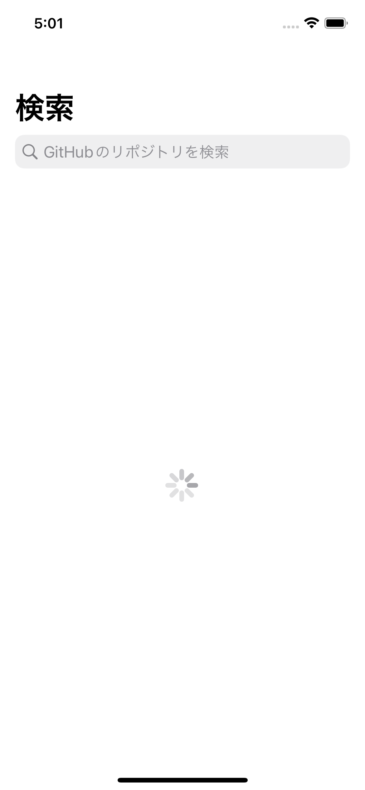
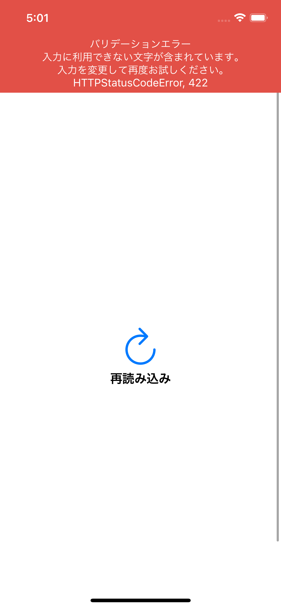

# 株式会社ゆめみ iOS エンジニアコードチェック課題

## 概要

株式会社ゆめみ インターン iOS提出課題

課題リポジトリ: https://github.com/yumemi-inc/ios-engineer-codecheck

## アプリ仕様・動作・説明

本アプリはGitHubのリポジトリを検索するアプリです。

- iOS15以上
- iPhoneのみ, 画面回転非対応

| 検索ホーム | 検索 | 詳細1 | 詳細2 |
| ------ | ------ | ------ | ------ |
|  |   |  |  |

### 検索ホーム
- アプリを開いた直後の画面
- 各セルには`所有者のアイコン`, `所有者名`, `リポジトリ名`, `説明`, `スター数`, `言語`を表示
- App StoreアプリのToday画面やGitHubアプリを参考にレイアウトを作成
- ナビゲーションの検索バーに文字を入れ検索することで検索結果を表示
- セルをタップすることで詳細画面に遷移

### 検索
- 検索結果を表示
- セルをタップすることでリポジトリ詳細画面に遷移

### 詳細
- 見出し, カウント, Readmeの3部分によって構成
- 見出し: `所有者のアイコン`, `所有者名`, `リポジトリ名`, `説明`, `言語`を表示
- カウント: `スター数`, `Watchers数`, `Fork数`, `Issue数`を表示
- Readme: リポジトリの`Readme.md`を表示
    - 現状、リポジトリ内の画像埋め込み・相対パスによるリンク参照は押しても何も起きません
    - URLによる画像埋め込み・絶対パスによるリンク参照は動作します
- 全体的にGitHubアプリのリポジトリ詳細画面を参考にレイアウトを作成

### その他
- 全画面ダークモードに対応
- 検索画面と詳細画面Readmeがロード中は`UIActivityIndicator`でロード中表示
- エラーが発生した場合はバナーでメッセージを表示

|  |  | |
| ------ | ------ | ------- |
|  |  |  |

## セットアップ方法

特になし。

ライブラリは全て`Swift Package Manager`を用いて導入しているため、`.xcodeproj`を開くと自動でダウンロードされます。

## コードについて
### 設計思想・アーキテクチャ

- UI層はMVPで作成
    - UIKitの標準的な機能を使った一般的な(角の立たない)アーキテクチャが課題に適していると考えたため
    - `View`, `Presenter`の両方ともprocotolを介して抽象に依存する
- レイアウトは主に`StoryBoard`を利用, 1`StoryBoard`-1`ViewController`方式を採用
    - segueの遷移よりコードでの遷移の方がハンドリングしやすいと考えたため
    - 1つの`StotryBoard`で複数画面を管理するのは複数ブランチでの同時作業をしたい場合に非効率だと考えたため
- [MicroViewController](https://fortee.jp/iosdc-japan-2018/proposal/ef7c210d-d4dc-4a91-9601-e9d1edba441a)を利用して詳細画面等の機能が多い画面でもViewControllerを細かく分割して記述
- Data, Model層は`Clean-Architecture`を考え方を採用
    - `Repository`: データの関連ごとにまとめて`Data`層からデータを取得・処理する
    - `Usecase`: 各画面等、使われ方ごとに`Repository`をまとめたもの

細かいクラスの設計については以下のPRの説明欄をご覧ください。

- [アーキテクチャを適用/プロジェクト構成・Presentation層修正](https://github.com/kntkymt/yumemi-ios-engineer-codecheck/pull/4)
- [アーキテクチャを適用/APIの処理をするDomain・Data層を作成する](https://github.com/kntkymt/yumemi-ios-engineer-codecheck/pull/5)
- [アーキテクチャを適用/Presentation層をMVPにする](https://github.com/kntkymt/yumemi-ios-engineer-codecheck/pull/6)

### テスト

以下のPRの説明欄をご覧ください。

- [テストを追加/API・Repository・Usecaseの単体テスト,結合テスト](https://github.com/kntkymt/yumemi-ios-engineer-codecheck/pull/17)
- [テストを追加/UIテストを追加する](https://github.com/kntkymt/yumemi-ios-engineer-codecheck/pull/18)

## 課題について

- 各PRに関係する課題をラベルとしてつけてあります。
- 課題部分の変更を確認したい場合は以下を参考にPRをご覧ください。

| 課題 | 対応するラベル |
| ------ | ------ |
| [ソースコードの可読性の向上](https://github.com/yumemi-inc/ios-engineer-codecheck/issues/2) | ソースコードの可読性の向上 |
| [ソースコードの安全性の向上](https://github.com/yumemi-inc/ios-engineer-codecheck/issues/3) | ソースコードの安全性の向上 |
| [バグを修正](https://github.com/yumemi-inc/ios-engineer-codecheck/issues/4) | バグを修正 |
| [FatVCの回避](https://github.com/yumemi-inc/ios-engineer-codecheck/issues/5), [アーキテクチャを適用](https://github.com/yumemi-inc/ios-engineer-codecheck/issues/7), [プログラム構造をリファクタリング](https://github.com/yumemi-inc/ios-engineer-codecheck/issues/6) | アーキテクチャ |
| [テストを追加](https://github.com/yumemi-inc/ios-engineer-codecheck/issues/10) | テスト |
| [UIをブラッシュアップ](https://github.com/yumemi-inc/ios-engineer-codecheck/issues/8), [新機能を追加](https://github.com/yumemi-inc/ios-engineer-codecheck/issues/9) | UIUX新機能  |
